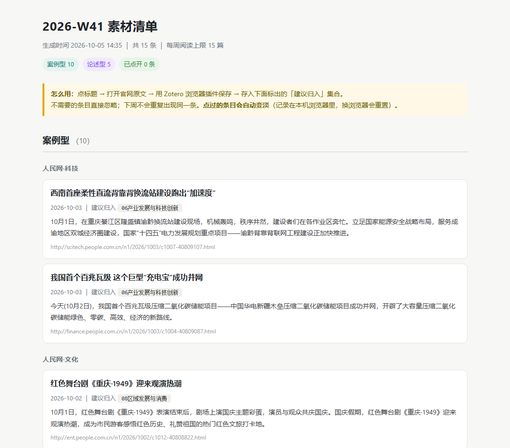

# shenlun-reservoir

> **申论素材的水库。** 每天把看到的都蓄进去（**永不删除**），每周定量放 15 条出来读。

每天自动从官网抓取素材存进本地索引，每周从索引里挑 15 条生成一份候选清单放到桌面。
你在清单里挑，满意的用 Zotero 浏览器插件存档，然后在（含手机端）Zotero 里慢慢读。

选材依据是**历年申论真题**：真题的"给定资料"是新闻通讯/基层调研写法，
以「真实地名 + 人物原话 + 具体做法」为主，所以清单以**案例型**素材为主体。



## 它解决什么问题

> 它不是新闻聚合器，而是一座**只蓄不放的水库** —— 蓄的是全量，放的是每周 15 条。

| 常见做法 | 卡在哪 |
|---|---|
| 手动收藏文章 | 攒一堆没读，回头也找不到 |
| 用 RSS 阅读器 | 每天几百条读不完；想找某篇翻不出来 |
| 让 AI 帮筛 | 筛掉的就没了，不知道丢了什么 |

```
① 抓取（每天）──写入──▶ ② SQLite 索引（永不删）──读取──▶ ③ 每周挑 15 条出清单
```

**筛选只影响「这周给你看什么」，不影响「库里有什么」。** 没被挑中的仍留在索引里，可检索、可回看。
这是整套设计最重要的一点。

## 适合谁

- 备考公务员 / 事业单位，想长期积累**申论素材**的人
- 已经在用 **Zotero** 做阅读管理的人（这套的阅读端就是 Zotero）
- 愿意在本地跑一个 RSSHub 服务的人

**不适合**：想开箱即用、完全不碰命令行的用户。

## 快速开始

| 依赖 | 要求 | 说明 |
|---|---|---|
| **Python** | 3.8+ | **零第三方依赖**，不需要 `pip install` |
| **Node.js** | `^22.22.2 \|\| ^24.15.0` | RSSHub 的要求，装 Node 24 LTS 最稳 |
| **Git** | 任意 | 用来克隆 RSSHub |
| **Zotero** | 7+ | *可选*。没有也能跑，只少一层「已存档去重」 |

```powershell
# ① 装 RSSHub —— 必须放纯英文路径（中文路径会让 pnpm 装不上）
git clone --depth 1 https://github.com/DIYgod/RSSHub.git D:\rsshub-engine
cd D:\rsshub-engine
$env:CI='true'; corepack pnpm install      # 约 700 MB / 5-15 分钟

# ② 把本仓库放到 D:\公考工作流

# ③ 生成配置：复制模板，改那 4 个路径
cd D:\公考工作流
copy sources.example.json sources.json
notepad sources.json

# ④ 手动跑一次
python fetch_daily.py                      # 抓取入库（需联网）
python weekly_digest.py                    # 生成清单到桌面

# ⑤ 注册定时任务（可选，见使用手册第二节）
```

清单是一份 HTML（另有 MD / JSON），每条含**标题、来源、日期、摘要、「建议归入」哪个 Zotero 集合**
（样子见[开头的截图](#shenlun-reservoir)）。日常就三个动作：
**打开桌面 HTML → 挑感兴趣的 → 点开链接、`Ctrl+Shift+S` 用 Zotero 存档**。

## 工作原理

| 层 | 脚本 | 频率 | 干什么 |
|---|---|---|---|
| ① 抓取 | `fetch_daily.py` | 每天 19:30 | 抓 11 个源 → 过滤通稿 → 判重 → 写入索引。**不生成清单** |
| ② 存储 | `index.sqlite` | — | 抓到的一切都在这里，**永不删除** |
| ③ 展示 | `weekly_digest.py` | 每周日 20:00 | 从索引挑 15 条 → 生成 HTML/MD/JSON |

**为什么这样分**：如果「筛选」和「抓取」耦合，被筛掉的就永远没了。分开之后筛选可以放心地严，
因为**库里始终是全量**。

**为什么每周 15 条**：这是「读得完」的上限。索引里存量远不止 15 条，
按各源配额 + 类型配比挑出最值得先读的。

**去重四层**：

| 层 | 机制 |
|---|---|
| 1 | URL 指纹（统一 https、去 `www.`、去锚点与 `utm_*`） |
| 2 | 标题指纹（剥栏目名/形态词后精确比对） |
| 3 | 模糊匹配（字符二元组 Dice ≥ 0.78）+ **数字守卫** |
| 4 | 确定性剔除（版面署名、图片报道、礼节问候等**形态噪音**） |

> 跨源转载是官媒常态：同一篇新华社稿，人民网、求是网各发一次，**URL 不同、标题还常被改写**。
> 第 3 层就是为这个准备的。数字守卫则防止把「8月发布会」和「7月发布会」误判成同一篇。

## 配置

全部在 `sources.json`（从 `sources.example.json` 复制）。**必改的 4 个路径**：
`rsshubDir`（引擎目录）、`indexPath`（索引位置）、`outputDir`（清单输出）、`zoteroDb`。

常用调整：

| 想做什么 | 改哪 |
|---|---|
| 加 / 停一个源 | `sources[]` 的 `path` / `enabled` |
| 改每源数量 | `sources[].quota` |
| 改类型配比 | `typeCaps`（键顺序也决定清单分组顺序） |
| 过滤通稿 | `titleFilter.hardBlock` / `softBlock` |

## 常见问题

| 现象 | 原因与处理 |
|---|---|
| 某源显示 `HTTP 503` | 官网改版导致 RSSHub 选择器匹配 0 条。**不是网络问题**。到 RSSHub 提 issue，或把该源 `enabled` 设为 `false` |
| 清单少于 15 条 | 正常。各源独立取配额，某源那周没内容名额就浪费了，**不会从别的源补货** |
| 清单是空的 | 跑 `python fetch_daily.py --stats` 看索引里还有多少待展示 |
| 计划任务结果非 0 | 抓取返回 **2** = 所有源都失败，通常是没联网 |
| `pnpm install` 报 `NO_TTY` | 先设 `$env:CI='true'` |
| RSSHub 启动失败 | 确认路径纯英文；移动过目录要重装依赖 |

- **联网**：抓取（每天）**需要**联网；出清单（每周）**不需要** —— 只读本地索引。断网一两天清单照样出得来。
- **息屏 / 睡眠**：显示器关闭 ≠ 系统睡眠。只息屏时任务照跑；系统睡眠则不跑，但设了
  `StartWhenAvailable`，**开机后会补跑一次**。

完整排错清单见 [使用手册 第五节](docs/使用手册.md)。

## 设计依据

选材规则不是拍脑袋定的，是从 **11 份申论真题**（国考 2020–2026、天津 2022–2025）实测倒推的：

| 实测结论 | 影响 |
|---|---|
| 材料型（归纳概括+词句理解+对策）**440 分** vs 论述型（公文+大作文）**245 分** ≈ **64:36** | `typeCaps` 定为 **10:5** |
| 给定资料里**政策文件原文只出现 23 次**，而人物引语 667 次、具体地名 352 次 | 清单以**案例型**为主体，但保留政策源给大作文积累语言 |
| 主题分布：科技创新 420 > 文化 302 > 乡村振兴 297 ≫ **经济财政金融 19** | 据此重排各源配额 |

**一个被实测否掉的方案**：曾打算加「含具体地名 +1、含人物引语 +1」的加权打分，实测后放弃 ——
地名信号严格匹配只覆盖 **5.4%**，在最需要的源上几乎为零（人民网·科技 0/28）。
改为**确定性剔除 + 用 Zotero 命中率反哺配额**。

## 文档

| 文件 | 内容 |
|---|---|
| [docs/使用手册.md](docs/使用手册.md) | **完整文档**：操作步骤、定时任务、配置详解、去重机制、排错、设计依据 |
| [docs/方案-重整版.md](docs/方案-重整版.md) | 最初的设计方案 |
| [docs/news-pipeline-research.md](docs/news-pipeline-research.md) | RSSHub 路由与开源工具调研 |

## 这个工作流刻意不做的事

| 不做 | 原因 |
|---|---|
| 自动写入 Zotero | 用浏览器插件存即可；`zotero/translators` 里没有 gov.cn 的 translator，元数据本来就要手动补 |
| 自动分类 | 找不到免费可用的中文政策分类器；分类基本由来源决定 |
| 微信公众号 | 微信没有公开 API，主流自建方案 `wewe-rss` 已归档 |
| 用 AI 筛素材 | 筛掉的就没了，且不可复现。改用确定性规则 + 索引兜底 |

## License

[MIT](LICENSE)
